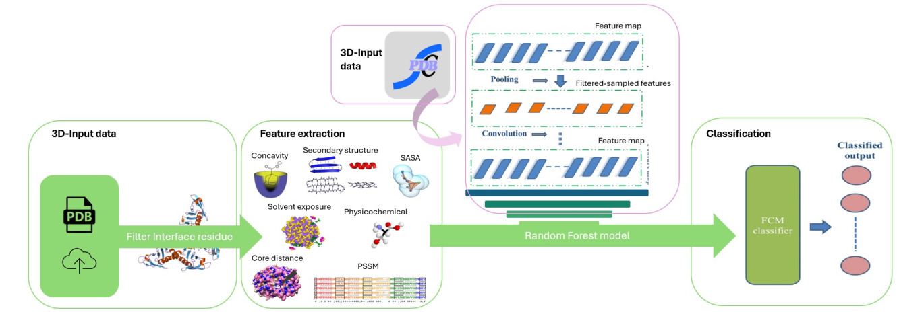

# PocketSeeker: A ligand binding site predictor for proteins


------------------------------------------------------------------------

## Table of Contents

- [Workflow](#-workflow)
- [Project Description](#-project-description)
- [Setup Instructions](#️-setup-instructions)
- [How pocketseeker.py Works](#-how-pocketseekerpy-works)
- [Repository Structure](#️-repository-structure)
- [Web Application](#-web-application)
- [Technologies Used](#-technologies-used)
- [License](#-license)
- [Contact](#-contact)

------------------------------------------------------------------------

## Workflow

Below is a simplified diagram of the workflow of this proyect.



------------------------------------------------------------------------

## Project Description

PocketSeeker is a bioinformatics tool designed to predict the binding site residues of a protein using machine learning techniques. The core of the application is a Random Forest classifier trained on structural and sequence-based features extracted from protein data. Given a protein structure in PDB format or a PDB ID, PocketSeeker analyzes each residue and determines its likelihood of being part of a binding site.

This tool aims to assist researchers in identifying potential functional regions of proteins, which can be crucial for tasks such as drug design, protein engineering, or functional annotation.

------------------------------------------------------------------------

## ⚙️ Setup Instructions

To get started with PocketSeeker, follow the steps below to set up the project on your local machine.

### 1. Clone the repository

Clone the PocketSeeker repository using Git:

```         
git clone https://github.com/marcarreaza/pocketseeker.git
cd pocketseeker
```

### 2. Run the setup script

Execute the provided setup script to create and configure the Conda environment:

```         
bash setup.sh
```

This script automatically creates a Conda environment named pocketseeker with all required dependencies. It detects whether the system is running on Linux or macOS and installs the appropriate binaries and tools accordingly.

### 3. Activate the environment

Once the setup is complete, activate the environment manually:

```         
conda activate pocketseeker
```

### 4. (Optional) Add PocketSeeker to your system PATH

To run pocketseeker.py from any location as a command-line tool, you can add the project folder to your system PATH. For example:

```         
export PATH=$PATH:/path/to/pocketseeker
```

Replace `/path/to/pocketseeker` with the absolute path to the cloned repository. You can also add this line to your `.bashrc`, `.zshrc`, or equivalent shell config file to make it permanent.

------------------------------------------------------------------------

## ️🔎 How pocketseeker.py Works

pocketseeker.py is the main script of the PocketSeeker application. It provides multiple execution modes depending on the input type and desired output behavior. Below is a summary of the most common usage options:

### 1. Analyze a single PDB file

```         
pocketseeker.py protein.pdb
```

Analyzes the provided PDB file and creates a folder called `results/` (if it doesn't exist) in the current working directory. Two files are generated:

-   `binding_sites_predictions.csv`: CSV matrix with residue-wise binding site predictions.
-   `modified_{file_basename}.pdb`: A modified PDB file with predicted binding residues marked for visualization.

### 2. Visualize results directly in UCSF Chimera

```         
pocketseeker.py -ch protein.pdb
```

After analysis, opens UCSF Chimera to visualize the structure with the predicted binding sites highlighted.

***Note:*** This only works when analyzing single files.

### 3. Analyze all PDB files in a directory

```         
pocketseeker.py -d path/to/directory
```

Scans the specified folder for .pdb files and processes them one by one. Each result is saved in `results/{file_basename}/`.

### 4. Analyze multiple local PDB files

```         
pocketseeker.py -local_many protein1.pdb protein2.pdb ...
```

Processes each PDB file listed and stores the outputs separately in `results/{file_basename}/` for each input.

### 5. Download and analyze a protein from the PDB Bank

```         
pocketseeker.py -online PDB_ID
```

Downloads the structure of the specified PDB ID from the Protein Data Bank, runs the analysis, and saves the output in the `results/` directory.

### 6. Analyze multiple proteins from the PDB Bank

```         
pocketseeker.py -online_many PDB_ID1 PDB_ID2 ...
```

Downloads and analyzes each of the listed PDB IDs. Each result is stored in `results/{PDB_ID}/`.

### 7. Specify a custom output directory

```         
pocketseeker.py -o output/
```

Use this option to override the default output location (`results/`) with a custom folder path.

### 8. Use a custom machine learning model

```         
pocketseeker.py -model custom_model.joblib
```

Allows the user to specify a custom Random Forest model (in `.joblib` format) instead of using the default pre-trained model included in the repository.

------------------------------------------------------------------------

## 🗂️Repository Structure

The repository is organized as follows:

```         
├── docs                       # Supplementary documentation and project figures
│   ├── features_info.pdf      # Description of input features used by the model
│   ├── metrics_info.pdf       # Model evaluation metrics and performance plots
│   └── suppl_info.pdf         # Additional supplementary information
├── extract_features           # Modules for computing structural and biochemical features
│   ├── PSSM
│   ├── SASA
│   ├── concavity
│   ├── core_distance
│   ├── model_features.py
│   ├── physicochemical
│   ├── secondary_structure
│   └── solvent
├── model                      # Trained model and script for inference
│   ├── random_forest.py       # Model definition and prediction logic
│   └── random_forest_binding_site_model.joblib # Our pre-trained Random Forest model
├── pocketseeker.py            # Main script to run feature extraction and prediction
├── programs                   # External binaries and third-party tools (e.g., DSSP, MSMS)
├── setup.sh                   # Environment setup script 
└── tutorials                  # Example workflows for users
    ├── run_example            # Sample inputs and instructions for model inference
    └── train_model            # Scripts and examples for retraining the model
```

------------------------------------------------------------------------

## 🌐 Web Application

A user-friendly web interface is available to facilitate access to PocketSeeker without requiring local installation or command-line usage. The application is hosted at the following address:

[**https://pocketseeker-web-1.onrender.com**](https://pocketseeker-web-1.onrender.com)

Features: 
- Upload PDB files or input UniProt/PDB IDs for automatic retrieval. 
- Run the full pipeline of feature extraction and binding site prediction. 
- Visualize prediction results interactively. 
- Download CSV output with residue-level predictions. 
This platform is intended to support non-technical users and facilitate quick exploration of protein structures and potential binding sites.

------------------------------------------------------------------------

## 💻 Technologies Used

- Python 3.9+
- scikit-learn – Machine Learning
- Biopython – Bioinformatics tools
- UCSF Chimera – Visualization
- External tools: `DSSP`, `MSMS`, `PSI-BLAST`

------------------------------------------------------------------------

## 📄 License

This project is licensed under the [Apache License 2.0](LICENSE).
